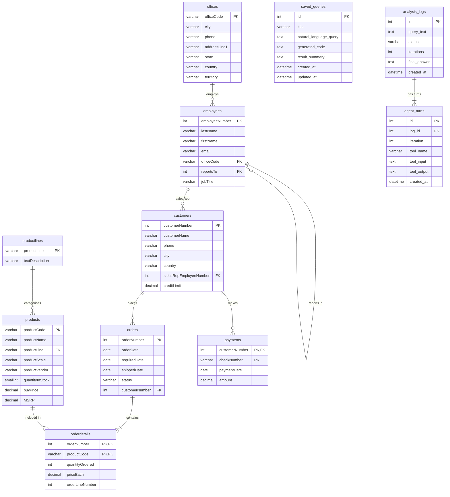

# InsightAgent

> **Enterprise Sales Data API with an LLM-Powered Self-Loop Analysis Agent**

InsightAgent is a production-ready web API built on **FastAPI + MySQL 8 + Docker**. It exposes classic sales data through a conventional REST interface, and extends it with a **Qwen-driven autonomous analysis agent** that accepts natural language questions, iteratively explores the database, writes and executes sandboxed Python code, and returns a structured answer — all within a single API call.

---

## Key Features

- **19 REST endpoints** covering employees, products, full CRUD saved queries, pre-built analytics, and the LLM agent
- **Qwen self-loop agent** — autonomously chains `observe_schema → run_python_analysis → final_answer` over up to 8 iterations to answer complex multi-step questions
- **Three-layer sandbox security** — AST guard (static), SQL guard (keyword), and subprocess isolation (runtime), backed by a read-only database account, blocking code injection at every stage
- **AI Judge testing** — a second Qwen LLM call evaluates agent answers semantically, replacing brittle string matching with reasoning-based pass/fail judgement
- **93-test suite** across 6 test files, covering success paths, error cases, jailbreak/prompt-injection resistance, multi-step reasoning, and anomaly detection
- **Automatic persistence** — every agent run saves generated code and result to `saved_queries`; turn-by-turn LLM reasoning is logged to `analysis_logs`
- **X-API-Key authentication** on all business endpoints
- **Correct HTTP status codes** for every error case (401/403/408/422/500)

---

## Technology Stack

| Component | Technology | Justification |
|-----------|------------|---------------|
| API Framework | FastAPI (Python 3.11) | Async-ready, auto-generates OpenAPI/Swagger, Pydantic validation built-in |
| Database | MySQL 8 | Mature ACID-compliant relational DB; `enterprise_api` holds the Classic Models dataset |
| ORM | SQLAlchemy 2.0 | Declarative models, connection pool management, dual-session support |
| LLM Agent | Qwen via Alibaba Bailian | OpenAI-compatible API — no SDK lock-in; swap model/provider by changing one env var |
| Containerisation | Docker + Docker Compose | Single-command reproducible stack; MySQL auto-initialises on first boot |
| Data | Classic Models (Kaggle) | Rich relational sales dataset with employees, products, orders, payments |

---

## Architecture

```
┌──────────────────────────────────────────────────────────────────┐
│                       Docker Compose Network                      │
│                                                                    │
│  ┌───────────────────────────┐    ┌───────────────────────────┐  │
│  │     FastAPI Container      │    │     MySQL 8 Container      │  │
│  │     (insightagent_api)     │◄──►│   (insightagent_mysql)    │  │
│  │                            │    │                            │  │
│  │  app_rw ── CRUD routes     │    │   enterprise_api database  │  │
│  │  app_ro ── Skills &        │    │   (classicmodels data +    │  │
│  │            Analytics       │    │    saved_queries, logs)    │  │
│  └───────────────────────────┘    └───────────────────────────┘  │
└──────────────────────────────────────────────────────────────────┘
```

**Dual-account design:**

| Account | Permissions | Used by |
|---------|-------------|---------|
| `app_rw` | SELECT / INSERT / UPDATE / DELETE | CRUD routes (employees, products, saved-queries) |
| `app_ro` | SELECT only | Analytics, `observe_schema`, `run_python_analysis` sandbox |

This means even if LLM-generated code somehow bypassed the Python-level guards, the database account itself prevents any write operations.

---

## Database Schema



The top 8 tables are the Classic Models business dataset. `saved_queries`, `analysis_logs`, and `agent_turns` are custom tables added by InsightAgent for persistence and auditability.

---

## Documentation

| Document | Format | Location |
|----------|--------|----------|
| **API Reference** | PDF | [`docs/API.pdf`](docs/API.pdf) |
| **Technical Report** | PDF | [`docs/Technical_Report.pdf`](docs/Technical_Report.pdf) |
| **Presentation Slides** | PPTX | [`docs/InsightAgent_presentation.pptx`](docs/InsightAgent_presentation.pptx) |
| **Interactive Swagger UI** | Web | `http://localhost:8000/docs` (requires running stack) |
| **OpenAPI JSON** | JSON | `http://localhost:8000/openapi.json` |

`docs/API.pdf` covers every endpoint, all parameters, example requests/responses, authentication flow, and error codes.

---

## Prerequisites

- [Docker Desktop](https://www.docker.com/products/docker-desktop/) (includes Docker Compose)
- A **Qwen API key** from [Alibaba Bailian](https://bailian.console.aliyun.com/) (free tier available)

---

## Quick Start

### 1. Clone the repository

```bash
git clone https://github.com/berwinye/InsightAgent.git
cd InsightAgent
```

### 2. Create the `.env` file

```bash
cp .env.example .env
```

Edit `.env` and fill in your credentials:

```env
MYSQL_ROOT_PASSWORD=rootpassword123
MYSQL_DATABASE=enterprise_api
MYSQL_APP_RW_USER=app_rw
MYSQL_APP_RW_PASSWORD=rw_password123
MYSQL_APP_RO_USER=app_ro
MYSQL_APP_RO_PASSWORD=ro_password123
MYSQL_HOST=mysql
MYSQL_PORT=3306

# API Authentication (leave empty to disable auth)
API_KEY=insightagent-secret-key

# Qwen LLM (Alibaba Bailian)
QWEN_API_KEY=sk-your-api-key-here
QWEN_MODEL=qwen-plus
QWEN_BASE_URL=https://dashscope.aliyuncs.com/compatible-mode/v1
```

### 3. Start with Docker Compose

```bash
docker compose up --build
```

On first start the MySQL container automatically:
1. Creates the `enterprise_api` database
2. Creates `app_rw` and `app_ro` accounts with appropriate permissions
3. Creates `saved_queries` and `analysis_logs` tables
4. Imports all Classic Models data

The API is available at **http://localhost:8000** once MySQL is healthy (≈ 30 seconds).

### 4. Verify

```bash
curl http://localhost:8000/health
# {"status":"ok","db_connections":{"rw":"ok","ro":"ok"}}

curl http://localhost:8000/docs   # Open Swagger UI in browser
```

---

## API Reference (Summary)

Full details including parameters, error codes, and response schemas are in [`docs/API.pdf`](docs/API.pdf). The system design and security architecture are documented in [`docs/Technical_Report.pdf`](docs/Technical_Report.pdf).

### Employees & Products (read-only)

| Method | Endpoint | Description |
|--------|----------|-------------|
| GET | `/employees` | List all employees (paginated) |
| GET | `/employees/{id}` | Get employee by ID |
| GET | `/products` | List all products (paginated) |
| GET | `/products/{code}` | Get product by code |

### Saved Queries (full CRUD)

| Method | Endpoint | Description |
|--------|----------|-------------|
| POST | `/saved-queries` | Create a saved query |
| GET | `/saved-queries` | List all saved queries |
| GET | `/saved-queries/{id}` | Get by ID |
| PUT | `/saved-queries/{id}` | Update by ID |
| DELETE | `/saved-queries/{id}` | Delete by ID |

### Analytics

| Method | Endpoint | Description |
|--------|----------|-------------|
| GET | `/analytics/store-sales-summary` | Revenue & order counts by office |
| GET | `/analytics/product-ranking` | Top products by revenue |
| GET | `/analytics/employee-performance` | Sales KPIs per employee |
| GET | `/analytics/sales-trend` | Monthly revenue trend (`?year=2004`) |
| POST | `/analytics/analyze` | **Natural language analysis (Qwen agent)** |
| GET | `/analytics/logs` | List past analysis run logs |
| GET | `/analytics/logs/{log_id}/turns` | Per-turn LLM reasoning for a run |

### Skills (agent tools, also callable directly)

| Method | Endpoint | Description |
|--------|----------|-------------|
| POST | `/skills/observe_schema` | Return full DB schema (tables, columns, PKs, FKs) |
| POST | `/skills/run_python_analysis` | Execute sandboxed Python code |

All endpoints except `GET /` and `GET /health` require `X-API-Key` header.

---

## LLM Analysis Agent

**Endpoint:** `POST /analytics/analyze`

```bash
curl -X POST http://localhost:8000/analytics/analyze \
  -H "X-API-Key: insightagent-secret-key" \
  -H "Content-Type: application/json" \
  -d '{"question": "Which product line generated the most revenue?"}'
```

```json
{
  "answer": "Classic Cars generated the most revenue at $3,853,438.94...",
  "iterations": 3,
  "generated_code": "df = read_sql('SELECT ...')\nprint(df)",
  "saved_query_id": 12,
  "log_id": 5,
  "tool_trace": ["observe_schema", "run_python_analysis", "final_answer"]
}
```

### Self-loop workflow (max 8 iterations)

```
User question
     │
     ▼
1. observe_schema  ──►  full DB schema injected into context
     │
     ▼
2. LLM generates Python analysis code
     │
     ▼
3. run_python_analysis  (sandboxed subprocess, app_ro account)
     │
     ├── success  ──►  LLM reads stdout  ──►  call final_answer
     │
     └── error    ──►  LLM reads error message  ──►  fix & retry
                            └── (up to 8 iterations total)
                                       │
                                       ▼
                               final_answer(text)  ◄──  stop
```

The agent can answer multi-step questions such as:
- *"Find the office with the lowest revenue, list its sales reps, and report their customer counts"*
- *"Which product is most overstocked relative to its sales history, and what is the inventory risk?"*

---

## Security Design

### Code Execution Pipeline

```
Submitted code
      │
      ▼  [Layer 1]
  AST Guard  ──(forbidden import/call)──►  403 SECURITY_VIOLATION
      │ pass
      ▼  [Layer 2]
  SQL Guard  ──(non-SELECT SQL)──────────►  403 SQL_BLOCKED
      │ pass
      ▼  [Layer 3 — Runtime]
  Subprocess Worker
  ┌─────────────────────────────────────┐
  │  Isolated process (no shared state) │
  │  read_sql() via app_ro DB account   │
  │  Restricted builtins (no open/eval) │
  │  30-second execution timeout        │
  └─────────────────────────────────────┘
      │
      ▼
  Structured JSON result
```

**Forbidden (AST-blocked before execution):**
`os`, `sys`, `subprocess`, `socket`, `requests`, `pathlib`, `open()`, `eval()`, `exec()`, `compile()`, `__import__()`

**Allowed imports:** `pandas`, `numpy`, `math`, `statistics`, `datetime`, `re`

---

## Testing

The project includes a comprehensive test suite with **93 tests across 6 files**.

```bash
# Run all tests (requires Docker stack running)
docker exec insightagent_api python -m pytest app/tests/ -v
```

### Test Suite Breakdown

| File | Tests | Coverage |
|------|-------|----------|
| `test_observe_schema.py` | 10 | Schema endpoint, auth failures |
| `test_run_python_analysis.py` | 20 | Valid code, security blocks, timeout, jailbreak |
| `test_saved_queries.py` | 15 | Full CRUD, validation, 404 handling |
| `test_api_negative.py` | 26 | Auth failures, invalid params across all endpoints |
| `test_multistep_agent.py` | 11 | Multi-step reasoning, tool trace, jailbreak/prompt injection |
| `test_anomaly_detection.py` | 11 | Data anomaly detection, AI Judge evaluation |

### AI Judge — LLM-Driven Semantic Evaluation

For tests where the expected output is a natural language answer (not a fixed string), a second Qwen LLM call acts as an **AI Judge**:

```
Agent answer + tool turn history
            │
            ▼
       Qwen AI Judge
  "Does the answer correctly complete
   all required analysis steps?"
            │
   ┌────────┴────────┐
  Yes                No
  (pass)           (fail + reasoning logged)
```

This approach is more robust than substring matching against non-deterministic LLM outputs. Flaky LLM tests also use `pytest-rerunfailures` (1 automatic retry) to handle transient API issues.

---

## Design Decisions

| Decision | Rationale |
|----------|-----------|
| **Dual DB accounts (`app_rw` / `app_ro`)** | Defence-in-depth: even if LLM-generated code bypasses Python guards, the DB account prevents any writes. |
| **Three-layer sandbox** (AST → SQL → subprocess) | Each layer catches a different threat class; static analysis is fast, subprocess isolation handles runtime surprises. |
| **Subprocess isolation** | Agent code runs in a child process — it cannot access FastAPI internals, environment variables, or in-memory state. |
| **`read_sql()` abstraction** | User code never holds a real DB connection; all queries pass through a trusted helper that enforces SQL guards and row limits (50 000 max). |
| **Agent self-loop** | A single LLM round fails on complex multi-table questions. The iterative pattern mirrors how a human analyst explores an unfamiliar dataset. |
| **AI Judge for testing** | LLM outputs are non-deterministic; evaluating them with another LLM call provides semantic correctness checks that are resilient to rephrasing. |
| **OpenAI-compatible Qwen API** | The `openai` Python client is used with a custom `base_url`, making the LLM provider swappable with one environment variable change. |

---

## Directory Structure

```
InsightAgent/
├── Dockerfile
├── docker-compose.yml
├── .env.example
├── requirements.txt
├── README.md
├── classicmodels.sql              ← source data
├── docs/
│   ├── API.pdf                    ← full API reference
│   ├── Technical_Report.pdf       ← system design & technical report
│   ├── InsightAgent_presentation.pptx  ← presentation slides
│   └── image/                     ← architecture & flow diagrams
├── docker/mysql/init/
│   ├── 01_setup.sh                ← creates DB users, custom tables
│   └── 02_import.sh               ← imports classicmodels data
└── app/
    ├── main.py
    ├── api/routes/
    │   ├── employees.py
    │   ├── products.py
    │   ├── saved_queries.py       ← full CRUD
    │   ├── analytics.py           ← pre-built analytics + agent endpoint
    │   └── skills.py              ← observe_schema + run_python_analysis
    ├── core/                      ← config, database engines, auth
    ├── db/                        ← rw/ro session factories, schema reader
    ├── models/                    ← SQLAlchemy ORM models
    ├── schemas/                   ← Pydantic request/response schemas
    ├── services/
    │   ├── analytics_service.py
    │   ├── agent_service.py       ← Qwen self-loop agent
    │   └── skills/
    │       ├── observe_schema.py
    │       ├── run_python_analysis.py
    │       ├── ast_guard.py       ← static AST security check
    │       ├── sql_guard.py       ← SQL keyword guard
    │       ├── python_worker.py   ← isolated subprocess executor
    │       └── result_serializer.py
    └── tests/
        ├── conftest.py
        ├── ai_judge.py            ← LLM-based semantic test evaluator
        ├── test_observe_schema.py
        ├── test_run_python_analysis.py
        ├── test_saved_queries.py
        ├── test_api_negative.py
        ├── test_multistep_agent.py
        └── test_anomaly_detection.py
```

---

## Stopping

```bash
docker compose down        # stop containers, keep data volume
docker compose down -v     # stop containers AND remove data
```

---

## GenAI Usage Declaration

This project was developed with the assistance of three GenAI tools, each serving a distinct role:

| Tool | Role | Specific Usage |
|------|------|----------------|
| **ChatGPT** | Ideation & Architecture | Brainstorming the overall project concept; designing the system and technical architecture including the dual-account DB pattern, three-layer sandbox pipeline, and LLM agent self-loop strategy |
| **Windsurf (Vibe Coding)** | Implementation & Testing | End-to-end code writing via AI-assisted pair programming — API routes, ORM models, agent service, sandboxed execution engine, full test suite (93 tests), AI Judge mechanism, and documentation |
| **Nano Banana** | Diagrams & Visuals | Creating architecture diagrams, workflow flowcharts, and visual illustrations used in the Technical Report and presentation slides |

All AI-generated output was critically reviewed, tested against real data, and refined. Core architectural decisions were independently justified; the AI accelerated execution rather than replacing engineering judgement.

Exported conversation logs from ChatGPT and Windsurf are attached as supplementary material per module requirements.
