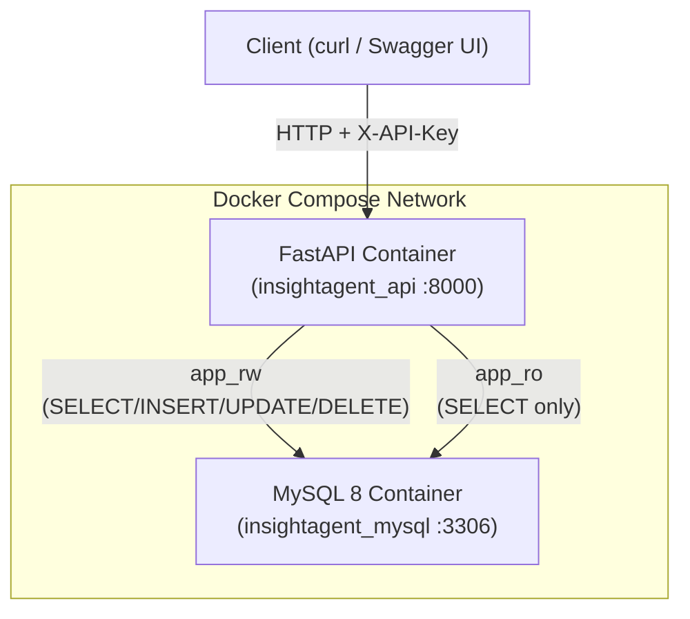
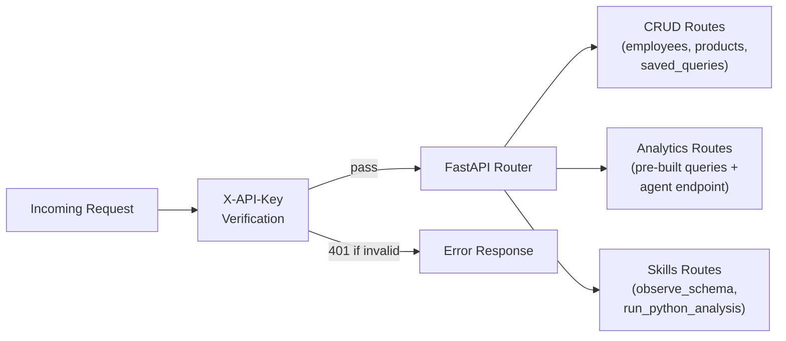
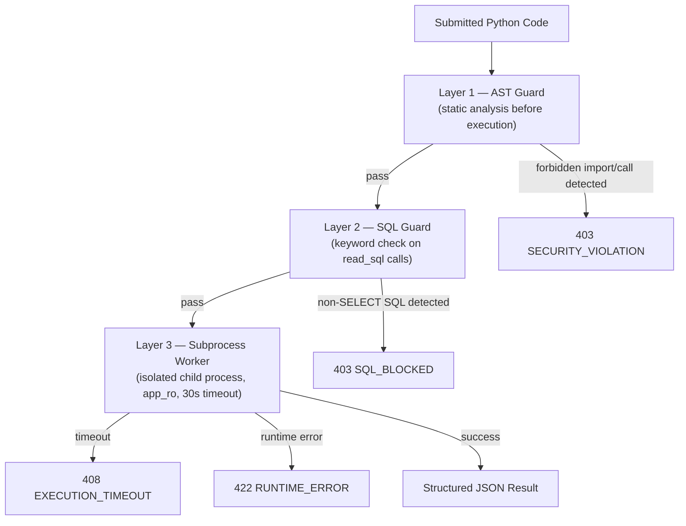
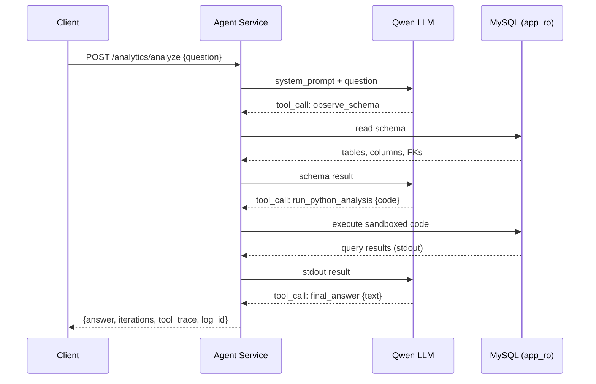
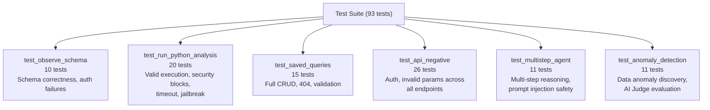

# InsightAgent — Technical Report

**Module:** XJCO3011 Web Services and Web Data  
**Assessment:** Coursework 1 — Individual Web Services API Development Project  
**GitHub:** https://github.com/berwinye/InsightAgent

---

## 1. Project Overview

InsightAgent is an enterprise sales data Web API that goes beyond conventional CRUD by embedding a **Qwen-powered self-loop analysis agent**. A client can POST a natural language question such as *"Which office had the lowest revenue last year, and which sales reps work there?"* and receive a structured answer derived entirely from live database queries — with no pre-written SQL or hard-coded logic.

The system is built on the Classic Models sales dataset and exposes 19 REST endpoints covering employees, products, saved queries, pre-built analytics, and the LLM agent. All business logic is containerised with Docker Compose for single-command reproducibility.

---

## 2. Technology Stack Justification

| Component | Choice | Justification |
|-----------|--------|---------------|
| **API Framework** | FastAPI (Python 3.11) | Async-ready, built-in Pydantic validation, auto-generates OpenAPI/Swagger UI with zero extra code |
| **Database** | MySQL 8 | Mature ACID-compliant RDBMS; chosen over PostgreSQL for wider hosting compatibility and because the Classic Models dataset is natively distributed as MySQL SQL |
| **ORM** | SQLAlchemy 2.0 | Declarative models reduce boilerplate; the dual-session pattern (read-write / read-only) is cleanly expressed through separate `sessionmaker` factories |
| **LLM** | Qwen via Alibaba Bailian | OpenAI-compatible API — the `openai` Python client is used with a custom `base_url`, making the provider swappable by changing one environment variable |
| **Containerisation** | Docker + Docker Compose | Eliminates "works on my machine" problems; MySQL initialisation scripts run automatically on first boot |
| **Testing** | pytest + pytest-rerunfailures | Standard Python testing framework; `rerunfailures` handles transient LLM API flakiness without manual intervention |

---

## 3. System Architecture

The system consists of two Docker containers communicating over an internal network. The FastAPI container connects to MySQL through **two separate database accounts** — a deliberate security design choice explained in Section 5.

**Request routing within FastAPI:**

---

## 4. Database Design

The database uses the **Classic Models** sample dataset (customers, orders, orderdetails, products, productlines, employees, offices, payments) extended with two custom tables:

- **`saved_queries`** — persists every agent run's question, generated code, and result summary for later retrieval
- **`analysis_logs` / `agent_turns`** — logs each LLM iteration, storing the tool called, the LLM reasoning, tool input, and tool output for full auditability

Concurrency is handled at the MySQL engine level through InnoDB row-level locking. The application layer uses SQLAlchemy connection pooling (`pool_size=5`, `max_overflow=10`) per account.

---

## 5. Key Design Decisions

### 5.1 Dual Database Accounts

Rather than a single database user, the system uses two accounts with different permissions:

| Account | Permissions | Used by |
|---------|-------------|---------|
| `app_rw` | SELECT / INSERT / UPDATE / DELETE | CRUD routes |
| `app_ro` | SELECT only | Agent sandbox, analytics, schema reader |

This provides **defence in depth**: even if an attacker crafted code that somehow bypassed all Python-level guards and reached the database driver, the `app_ro` account enforces a hard write-prohibition at the database level.

### 5.2 Three-Layer Code Execution Sandbox

User-submitted Python code (from the LLM or directly via the API) passes through three sequential security layers before execution:

**Layer 1 — AST Guard:** Python's `ast` module parses the code statically and rejects any import of `os`, `sys`, `subprocess`, `socket`, `requests`, `pathlib`, or any call to `open()`, `eval()`, `exec()`, `compile()`, `__import__()`. This check runs before a subprocess is even created.

**Layer 2 — SQL Guard:** The `read_sql()` helper available inside the sandbox inspects every SQL string for non-SELECT keywords (`INSERT`, `UPDATE`, `DELETE`, `DROP`, `CREATE`, etc.) before execution.

**Layer 3 — Subprocess Worker:** Code runs in a child process with a restricted namespace — no access to FastAPI's internal state, environment variables, or file system. Execution is killed after 30 seconds.

---

## 6. LLM Agent Design

The agent implements a **ReAct-style** (Reason + Act) self-loop. It has access to three tools and must call `final_answer` to terminate the loop.

**Key agent behaviours:**
- Always calls `observe_schema` first to understand available tables before writing any code
- On error: reads the error message, fixes the code, and retries (up to 8 iterations total)
- On the 7th iteration: the system prompt forces a `final_answer` call to prevent infinite loops
- All iterations are persisted to `agent_turns` for auditability via `GET /analytics/logs/{id}/turns`

---

## 7. Testing Strategy

The project includes **93 tests across 6 test files**, covering the full spectrum from unit-level validation to end-to-end LLM reasoning.

### AI Judge — LLM-Driven Semantic Test Evaluation

A key innovation in the testing approach is the **AI Judge**: for tests where the expected output is a natural language answer from the LLM agent (non-deterministic), a second Qwen LLM call evaluates the answer semantically rather than matching against a fixed string.

The AI Judge receives:
- The original question
- The agent's final answer
- The full turn-by-turn tool history (inputs and outputs)
- A human-written criteria string

It then outputs a reasoning paragraph followed by a binary `Yes`/`No` verdict. This approach is resilient to rephrasing and provides interpretable failure messages when a test does fail.

For transient LLM API failures, `pytest-rerunfailures` provides 1 automatic retry per test.

---

## 8. Challenges and Lessons Learned

| Challenge | Resolution |
|-----------|------------|
| **LLM non-determinism in tests** | Replaced brittle substring assertions with the AI Judge mechanism; tests now evaluate reasoning rather than exact wording |
| **Agent stuck in empty-result loops** | Added guidance in the system prompt that an empty query result is itself a finding; on iteration 7 the system forces `final_answer` |
| **SQL ambiguous column errors** | Fixed by aliasing columns in multi-table JOIN queries in the analytics service |
| **LaTeX PDF generation failing on Unicode** | Switched from `pdflatex` to Chrome headless (`--print-to-pdf`) for reliable PDF export |
| **Docker build network timeouts** | Configured registry mirror fallbacks in Docker daemon settings |
| **Flaky LLM tests in CI** | Added `pytest-rerunfailures` with `reruns=1` on LLM-dependent tests |

---

## 9. Limitations and Future Development

### Current Limitations

- **Single-user, stateless agent** — the agent has no memory of previous conversations; each `POST /analytics/analyze` starts fresh
- **No rate limiting** — the API currently has no per-IP or per-key rate limiting; a production deployment would require this
- **LLM dependency** — the agent requires an active Qwen API key; there is no fallback for offline/degraded LLM service
- **Row limit cap** — `read_sql()` is capped at 50,000 rows; very large result sets are silently truncated

### Future Development

- **Conversation memory** — persist multi-turn context so users can ask follow-up questions referencing prior answers
- **Streaming responses** — use Server-Sent Events to stream agent thinking steps to the client in real time
- **Multiple LLM backends** — abstract the LLM client to support OpenAI, Anthropic, and local models (Ollama)
- **Role-based access control** — issue scoped API keys with read-only or write permissions
- **Vector search** — embed `saved_queries` results for semantic retrieval of similar past analyses

---

## 10. Generative AI Declaration

Three GenAI tools were used throughout this project:

| Tool | Role | Usage |
|------|------|-------|
| **ChatGPT** | Ideation & Architecture | Brainstorming the project concept; designing the overall system architecture including the dual-account DB pattern, three-layer sandbox pipeline, and LLM agent self-loop strategy |
| **Windsurf (Vibe Coding)** | Implementation & Testing | AI-assisted pair programming for all code — API routes, ORM models, agent service, sandboxed execution engine, 93-test suite, AI Judge mechanism, and documentation |
| **Nano Banana** | Diagrams & Visuals | Architecture diagrams, workflow flowcharts, and visual illustrations for this report and the presentation slides |

All AI-generated output was critically reviewed, verified against the running system, and refined. The AI tools accelerated implementation; architectural judgements and trade-off decisions were made independently and are justified in this report.

Exported conversation logs from ChatGPT and Windsurf are attached as supplementary material.
