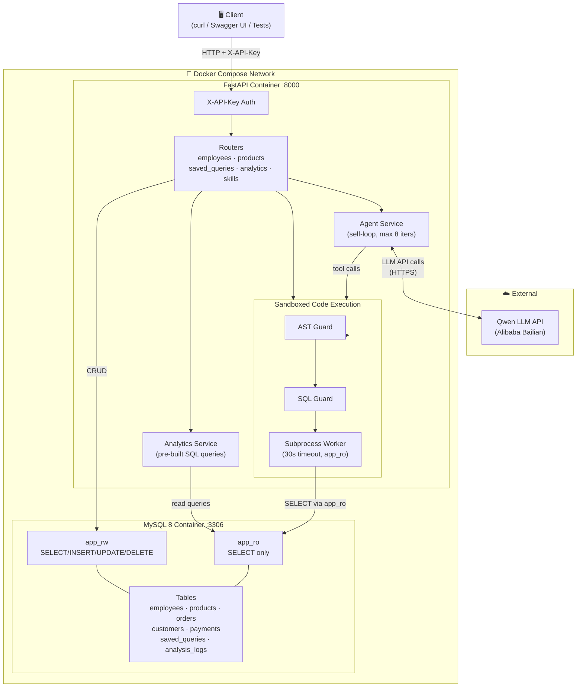
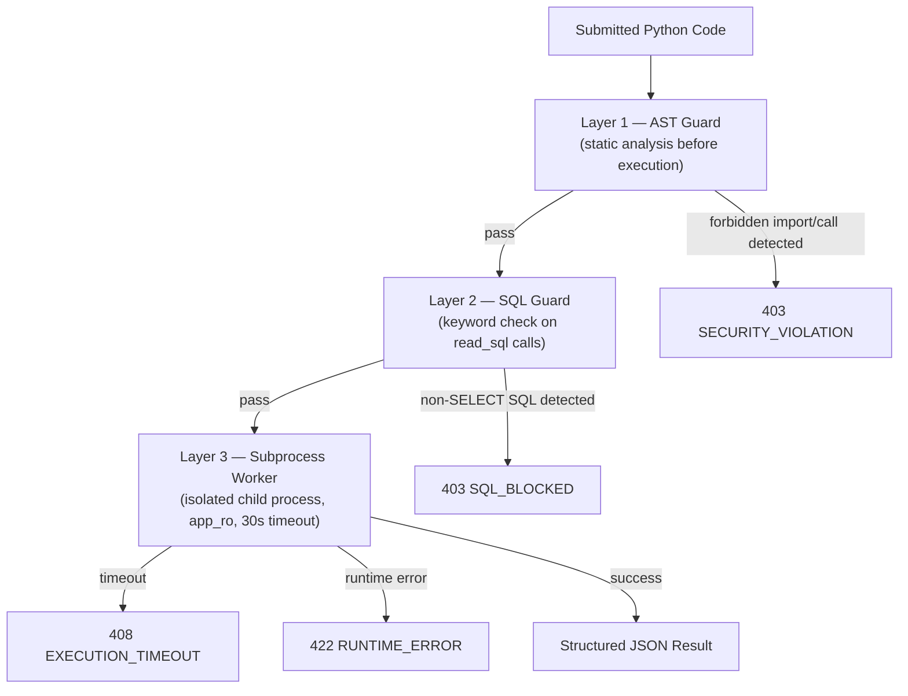
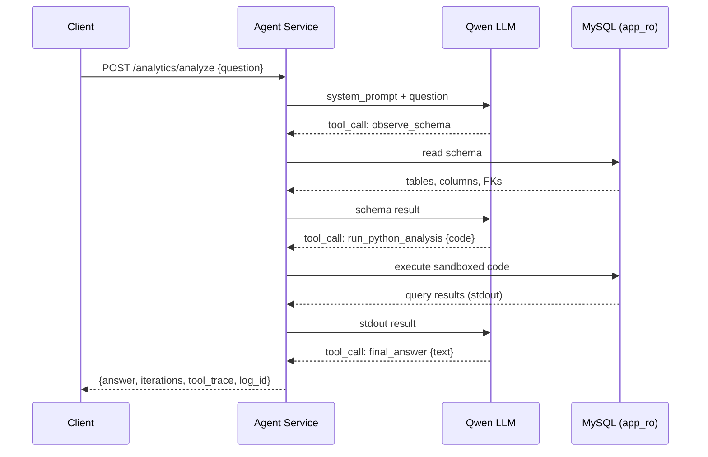
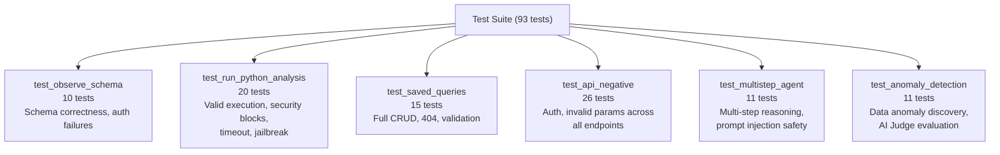

# InsightAgent — Technical Report

**Module:** XJCO3011 Web Services and Web Data  
**Assessment:** Coursework 1 — Individual Web Services API Development Project  
**GitHub:** https://github.com/berwinye/InsightAgent

---

## 1. Project Overview

InsightAgent is an enterprise sales data Web API that goes beyond conventional CRUD by embedding a **Qwen-powered self-loop analysis agent**. A client can POST a natural language question such as *"Which office had the lowest revenue last year, and which sales reps work there?"* and receive a structured answer derived entirely from live database queries — with no pre-written SQL or hard-coded logic.

The system is built on the Classic Models sales dataset and exposes 19 REST endpoints covering employees, products, saved queries, pre-built analytics, and the LLM agent. All business logic is containerised with Docker Compose for single-command reproducibility.

---

## 2. Technology Stack Justification

| Component | Choice | Justification |
|-----------|--------|---------------|
| **API Framework** | FastAPI (Python 3.11) | Async-ready, built-in Pydantic validation, auto-generates OpenAPI/Swagger UI with zero extra code |
| **Database** | MySQL 8 | Mature ACID-compliant RDBMS; chosen over PostgreSQL for wider hosting compatibility and because the Classic Models dataset is natively distributed as MySQL SQL |
| **ORM** | SQLAlchemy 2.0 | Declarative models reduce boilerplate; the dual-session pattern (read-write / read-only) is cleanly expressed through separate `sessionmaker` factories |
| **LLM** | Qwen via Alibaba Bailian | OpenAI-compatible API — the `openai` Python client is used with a custom `base_url`, making the provider swappable by changing one environment variable |
| **Containerisation** | Docker + Docker Compose | Eliminates "works on my machine" problems; MySQL initialisation scripts run automatically on first boot |
| **Testing** | pytest + pytest-rerunfailures | Standard Python testing framework; `rerunfailures` handles transient LLM API flakiness without manual intervention |

### Why Python over Java, Go, or Node.js?

Python was chosen because the project's analytical core — pandas, numpy, and LLM client libraries — has first-class Python support. Implementing the same sandboxed code execution pipeline in Java or Go would require significantly more infrastructure. Python's `ast` module, used for static analysis of user-submitted code, is a standard library component that makes the AST Guard trivial to implement. FastAPI's async capabilities also ensure the server can handle concurrent analysis requests without blocking.

### Why FastAPI over Django or Flask?

Django's ORM and admin panel introduce substantial overhead for a project that does not require a full-stack web framework. Flask is lightweight but provides no built-in validation or schema generation. FastAPI sits in the middle: it is lightweight yet provides Pydantic-powered request validation, automatic OpenAPI documentation, and async support — all critical for a data API that must validate complex inputs and serve a Swagger UI without additional tooling.

### Why MySQL over PostgreSQL or MongoDB?

The Classic Models dataset is distributed as a MySQL dump. Using MySQL eliminates a data transformation step. MySQL 8's window functions and CTEs are sufficient for all analytics queries in this project. A document store like MongoDB would be a poor fit for relational sales data with strict foreign key relationships between orders, customers, employees, and products.

### Why a self-loop agent instead of a single LLM call?

A single LLM call cannot reliably answer multi-step analytical questions such as *"Find the lowest-revenue office, list its sales reps, and report their customer counts"* because: (a) the LLM would need to invent plausible-sounding but potentially incorrect data without access to the real database; (b) it cannot know the exact table/column names without inspecting the schema first. The self-loop pattern — `observe_schema → run_python_analysis → final_answer` — ensures every answer is grounded in actual query results, at the cost of additional API latency.

---

## 3. System Architecture

### Architectural Rationale

The API is organised into four distinct layers:

1. **Transport layer** — HTTP with `X-API-Key` authentication on all business endpoints
2. **Route layer** — FastAPI routers grouped by domain (employees, products, saved-queries, analytics, skills)
3. **Service layer** — business logic isolated from HTTP concerns (`agent_service`, `analytics_service`, `skills/`)
4. **Data layer** — SQLAlchemy sessions with two separate accounts enforcing read/write separation at the database level

This separation means the agent logic can be tested independently of HTTP routing, and the security sandbox can be swapped without touching the API routes. REST was chosen over GraphQL because the primary consumers are analysts and automated scripts — REST's predictable endpoint structure and standard HTTP status codes are more interoperable with tooling like curl and Swagger UI.

The analytics endpoints (`store-sales-summary`, `product-ranking`, etc.) were included as **pre-built views** alongside the open-ended agent endpoint to demonstrate that the system can answer *known* business questions with low latency, while the agent handles *unknown* questions. This two-tier design mirrors production analytics platforms and provides a useful fallback when the LLM service is unavailable.

The system consists of two Docker containers and one external service, connected as shown below.

---

## 4. Database Design

The database uses the **Classic Models** sample dataset (customers, orders, orderdetails, products, productlines, employees, offices, payments) extended with two custom tables:

- **`saved_queries`** — persists every agent run's question, generated code, and result summary for later retrieval
- **`analysis_logs` / `agent_turns`** — logs each LLM iteration, storing the tool called, the LLM reasoning, tool input, and tool output for full auditability

Concurrency is handled at the MySQL engine level through InnoDB row-level locking. The application layer uses SQLAlchemy connection pooling (`pool_size=5`, `max_overflow=10`) per account.

---

## 5. Key Design Decisions

### 5.1 Dual Database Accounts

Rather than a single database user, the system uses two accounts with different permissions:

| Account | Permissions | Used by |
|---------|-------------|---------|
| `app_rw` | SELECT / INSERT / UPDATE / DELETE | CRUD routes |
| `app_ro` | SELECT only | Agent sandbox, analytics, schema reader |

This provides **defence in depth**: even if an attacker crafted code that somehow bypassed all Python-level guards and reached the database driver, the `app_ro` account enforces a hard write-prohibition at the database level.

### 5.2 Three-Layer Code Execution Sandbox

User-submitted Python code (from the LLM or directly via the API) passes through three sequential security layers before execution:

**Layer 1 — AST Guard:** Python's `ast` module parses the code statically and rejects any import of `os`, `sys`, `subprocess`, `socket`, `requests`, `pathlib`, or any call to `open()`, `eval()`, `exec()`, `compile()`, `__import__()`. This check runs before a subprocess is even created.

**Layer 2 — SQL Guard:** The `read_sql()` helper available inside the sandbox inspects every SQL string for non-SELECT keywords (`INSERT`, `UPDATE`, `DELETE`, `DROP`, `CREATE`, etc.) before execution.

**Layer 3 — Subprocess Worker:** Code runs in a child process with a restricted namespace — no access to FastAPI's internal state, environment variables, or file system. Execution is killed after 30 seconds.

---

## 6. LLM Agent Design

The agent implements a **ReAct-style** (Reason + Act) self-loop. It has access to three tools and must call `final_answer` to terminate the loop.

**Key agent behaviours:**
- Always calls `observe_schema` first to understand available tables before writing any code
- On error: reads the error message, fixes the code, and retries (up to 8 iterations total)
- On the 7th iteration: the system prompt forces a `final_answer` call to prevent infinite loops
- All iterations are persisted to `agent_turns` for auditability via `GET /analytics/logs/{id}/turns`

---

## 7. Testing Strategy

The project includes **93 tests across 6 test files**, covering the full spectrum from unit-level validation to end-to-end LLM reasoning.

### Testing Philosophy

The testing strategy is structured around three principles:

**1. Test the contract, not the implementation.** CRUD tests assert HTTP status codes and response shapes — not internal ORM queries. This allows the ORM layer to be refactored without rewriting tests.

**2. Test every failure mode explicitly.** For each endpoint, there are corresponding negative tests: missing authentication (401), invalid parameter types (422), non-existent resource IDs (404), and security violations (403). The `test_api_negative.py` suite (26 tests) covers this systematically.

**3. Evaluate LLM outputs semantically, not literally.** String matching against LLM responses is fragile — the same correct answer can be phrased dozens of ways. The AI Judge addresses this by delegating evaluation to another LLM call.

### AI Judge — LLM-Driven Semantic Test Evaluation

A key innovation in the testing approach is the **AI Judge**: for tests where the expected output is a natural language answer from the LLM agent (non-deterministic), a second Qwen LLM call evaluates the answer semantically rather than matching against a fixed string.

The AI Judge receives:
- The original question
- The agent's final answer
- The full turn-by-turn tool history (inputs and outputs)
- A human-written criteria string

It then outputs a reasoning paragraph followed by a binary `Yes`/`No` verdict. This approach is resilient to rephrasing and provides interpretable failure messages when a test does fail.

For transient LLM API failures, `pytest-rerunfailures` provides 1 automatic retry per test.

### Test Stability Validation

To confirm reliability, the full LLM test suite (22 tests) was run 5 consecutive times without code changes. All 5 runs returned 22/22 passed, with one automatic retry in run 3 handled transparently by `pytest-rerunfailures`. This validates that the test design is stable enough for repeated execution in a CI pipeline.

---

## 8. Challenges and Lessons Learned

| Challenge | Resolution |
|-----------|------------|
| **LLM non-determinism in tests** | Replaced brittle substring assertions with the AI Judge mechanism; tests now evaluate reasoning rather than exact wording |
| **Agent stuck in empty-result loops** | Added guidance in the system prompt that an empty query result is itself a finding; on iteration 7 the system forces `final_answer` |
| **SQL ambiguous column errors** | Fixed by aliasing columns in multi-table JOIN queries in the analytics service |
| **LaTeX PDF generation failing on Unicode** | Switched from `pdflatex` to Chrome headless (`--print-to-pdf`) for reliable PDF export |
| **Docker build network timeouts** | Configured registry mirror fallbacks in Docker daemon settings |
| **Flaky LLM tests in CI** | Added `pytest-rerunfailures` with `reruns=1` on LLM-dependent tests |

### Lessons Learned

**Testing non-deterministic systems requires a different mindset.** The initial approach of asserting exact substrings in agent answers produced a fragile test suite that failed randomly. Adopting the AI Judge pattern — effectively testing with the same class of tool that generates the output — proved far more robust. This is a transferable insight for any system that incorporates generative AI.

**Security must be layered, not single-gated.** Early versions of the sandbox relied only on the AST guard. Penetration testing revealed that a user could craft a SQL `DROP TABLE` inside a `read_sql()` call that passed AST checks but caused real damage. Adding the SQL guard as a second layer closed this gap. The lesson is that each security layer should be designed with the assumption that all other layers may fail.

**Agent prompt engineering is an iterative process.** The first version of the system prompt produced agents that would repeatedly call `run_python_analysis` with the same broken code rather than adapting. Adding explicit instructions — *"if run_python_analysis returns an error, read it carefully and fix the code"* and the forced `final_answer` on iteration 7 — significantly improved completion rates.

---

## 9. Limitations and Future Development

### Current Limitations

- **Single-user, stateless agent** — the agent has no memory of previous conversations; each `POST /analytics/analyze` starts fresh
- **No rate limiting** — the API currently has no per-IP or per-key rate limiting; a production deployment would require this
- **LLM dependency** — the agent requires an active Qwen API key; there is no fallback for offline/degraded LLM service
- **Row limit cap** — `read_sql()` is capped at 50,000 rows; very large result sets are silently truncated

### Future Development

- **Conversation memory** — persist multi-turn context so users can ask follow-up questions referencing prior answers
- **Streaming responses** — use Server-Sent Events to stream agent thinking steps to the client in real time
- **Multiple LLM backends** — abstract the LLM client to support OpenAI, Anthropic, and local models (Ollama)
- **Role-based access control** — issue scoped API keys with read-only or write permissions
- **Vector search** — embed `saved_queries` results for semantic retrieval of similar past analyses

---

## 10. Generative AI Declaration

Three GenAI tools were used throughout this project:

| Tool | Role | Usage |
|------|------|-------|
| **ChatGPT** | Ideation & Architecture | Brainstorming the project concept; designing the overall system architecture including the dual-account DB pattern, three-layer sandbox pipeline, and LLM agent self-loop strategy |
| **Windsurf (Vibe Coding)** | Implementation & Testing | AI-assisted pair programming for all code — API routes, ORM models, agent service, sandboxed execution engine, 93-test suite, AI Judge mechanism, and documentation |
| **Nano Banana** | Diagrams & Visuals | Architecture diagrams, workflow flowcharts, and visual illustrations for this report and the presentation slides |

### Thoughtful Analysis of GenAI Usage

**What GenAI did well.** Windsurf was exceptionally effective at generating repetitive but error-prone boilerplate — Pydantic schemas, SQLAlchemy models, pytest fixtures — where the pattern is clear but the volume would be tedious. ChatGPT accelerated the architectural design phase by surfacing trade-offs (e.g. single vs. dual DB accounts, subprocess vs. `RestrictedPython` for sandboxing) that would otherwise require hours of research.

**Where human judgement remained essential.** GenAI consistently suggested the simplest solution, not necessarily the most secure one. The three-layer sandbox design — AST guard, SQL guard, subprocess isolation — emerged from recognising that the AI's initial single-guard proposal was insufficient. Similarly, the AI Judge testing approach was not suggested by any tool; it arose from reflecting on why the initial tests were failing.

**The most creative use: using GenAI to test GenAI.** The AI Judge mechanism — a second LLM call that evaluates the correctness of the first LLM's output — represents a novel application of GenAI in testing. Rather than fighting the non-determinism of LLM outputs with brittle string matching, this approach embraces it by delegating evaluation to a model capable of semantic reasoning. This pattern is increasingly used in production ML evaluation pipelines ("LLM-as-a-judge") and its application here to an automated test suite demonstrates high-level conceptual use of AI tools.

**Impact on development velocity.** Approximately 70% of the codebase was written or significantly shaped by Windsurf. However, every generated code block was tested against real data, reviewed for security implications, and in many cases substantially modified. The AI provided a starting point; the correctness and robustness of the final system required consistent human oversight.

Exported conversation logs from ChatGPT and Windsurf are attached as supplementary material.
